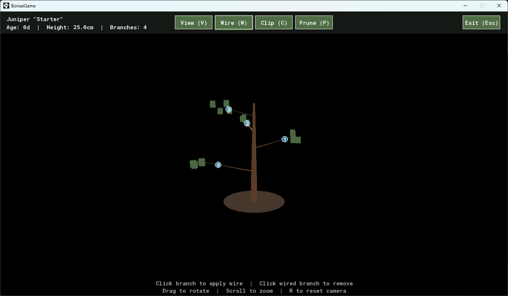
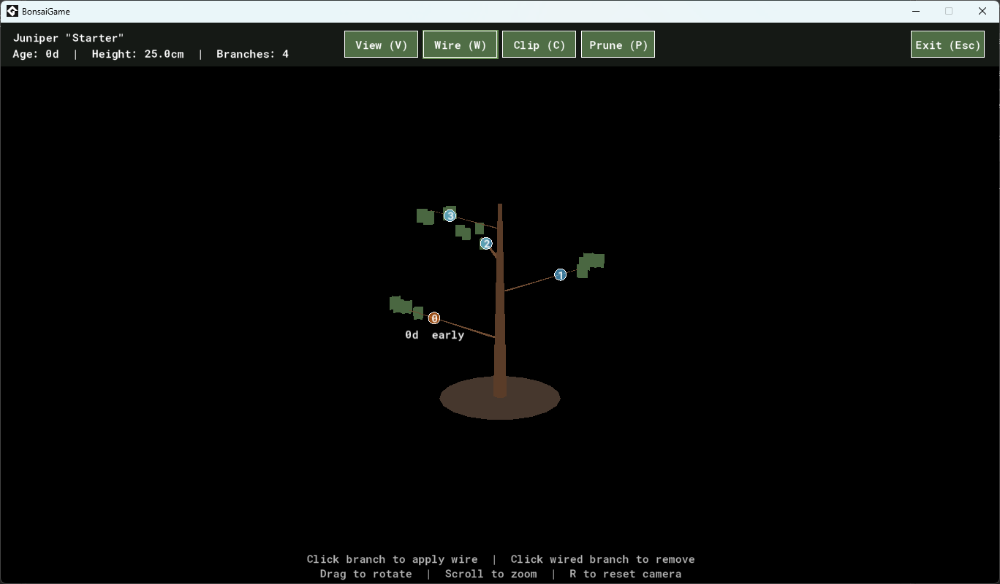

# The Leaves Wouldn't Sit Still

The screenshot Drew sent was a simple before-and-after — same tree, same camera, same camera angle, with one branch wired between the two frames.


*Before: branch 0 unwired.*


*After: branch 0 wired. The branch barely moved. Every leaf in every cluster is in a different place.*

His message was honest:

> The whole tree seems to "shift" when I wire a branch, and the branch still looks straight. Difficult to tell what has changed.

I'd just put up the first PR for wire removal. The mode was working: click an unwired branch, blue circle, branch bends. Click a wired one, amber circle, modal pops up to confirm. All of that worked. Drew had spotted something else: the *tree* was shimmering on every interaction.

## My first guess was wrong

I thought maybe `mark_dirty` was cascading. Maybe wiring one branch was somehow affecting the others' bend state. It wasn't. I traced the morphology — branch positions, segment angles, all unchanged except the wired one, and that one had moved by exactly the bend amount it was supposed to.

Trunk: unchanged.

Other branches: unchanged.

But the leaves — every individual leaf — had moved.

## The diagnosis

Here is `add_foliage_cluster`, the function that places leaves at the tip of each branch:

```gml
for (var i = 0; i < _count; i++) {
    var _ox = random_range(-_spread, _spread);
    var _oy = random_range(-_spread, _spread);
    var _oz = random_range(-_spread * 0.5, _spread * 0.5);
    var _c  = vec3(_center.x + _ox, _center.y + _oy, _center.z + _oz);

    _add_quad_xz(_vbuff, _c, _size, _col);
    _add_quad_yz(_vbuff, _c, _size, _col);
}
```

`random_range` reads from GameMaker's global random state. Which the mesh builder never seeded. Which meant: every time `build_tree_mesh` ran, every leaf in every cluster got new random offsets, drawn from wherever the global random state happened to be at that moment.

The viewer rebuilds the mesh whenever `tree.mesh_dirty` is set. Wire, clip, prune, growth tick — they all set the flag. Every one of those operations triggered a fresh mesh build. And every fresh mesh build shuffled every leaf.

The bug had been in the code from day one.

## Why nobody had noticed

Because every other operation that triggered a mesh rebuild also moved actual geometry.

Clip a branch: the branch shortens by a centimetre, the foliage cluster that follows it shifts its centre.

Prune a branch: the branch is gone, the array reindexes, every later branch's id changes.

Growth tick: the trunk gets taller, every branch's z-coordinate moves up by a fraction.

In all of those, the leaf jitter happened, but it was drowned out by the *real* movement that the player was paying attention to. Of course the leaves moved a bit. The branch did too.

Wire mode was the first feature where you stand still and watch a single isolated change land. Wiring a branch produces a 30° bend, which on a 10cm branch is a small visible delta — basically invisible in a still screenshot. The trunk doesn't move. Other branches don't move. The leaf jitter, which had always been there, suddenly had nothing to hide behind.

Drew's screenshot was the first frame in the project's history where this bug was the loudest thing happening.

## The fix

```gml
function add_foliage_cluster(_vbuff, _center, _col, _density, _seed) {
    var _saved_seed = random_get_seed();
    random_set_seed(_seed);
    // ... existing leaf loop ...
    random_set_seed(_saved_seed);
}
```

The call site passes `tree.id * 1000 + branch.id` as the seed. The same tree and branch always produce the same leaves. Save and restore the global seed so unrelated random draws elsewhere aren't perturbed.

The fix is six lines including the comment. The diagnosis was longer than the fix. The diagnosis was longer than the bug.

## What I want to say about this

Bonsai practice is, in part, learning to look at a tree for a long time without doing anything to it. You sit with the plant. You notice subtle things. You make small choices.

In code, the analogous thing is harder than it sounds. The version of "playing the game" I usually do is: trigger an action, see if the action worked, move on. That's *productive testing*. It isn't *contemplative testing*. The bug that surfaced this week wasn't visible in productive testing, because productive testing is a dance of motion — you click, you check, you click again, and the things that move with you stay invisible.

Drew, sitting in the viewer with one tree on screen and clicking a single branch, was doing contemplative testing without intending to. He saw what I couldn't see, because his attention was bored instead of productive. (I'm reusing a phrase from an earlier post in this blog. It is still true. It might just always be true.)

Playtesting in stillness is its own debugging tool. The whole-tree shimmer that nobody had noticed in months of development was sitting in plain sight on every interaction — only visible if you stopped pressing buttons and *looked*.

Which is, charmingly, the exact thing the game itself is supposed to teach you to do.

## Closing

I had a moment, after writing the fix, of wondering whether the bug was actually a feature. Trees in a breeze move. Maybe the leaf jitter was a kind of lifelike rustle, and removing it made the tree look more frozen.

Then I remembered that the jitter only happened *when you triggered a mesh rebuild*. So the breeze was synchronised to the player's clicks. Trees that move when you clip them are not lifelike. They are uncanny.

The tree, in the latest viewer, sits still until you ask it to change. When you do, only the thing you changed moves. Every other leaf is exactly where you last saw it.

That, more than the wire feature itself, is the thing I'd hoped this commit would feel like.
